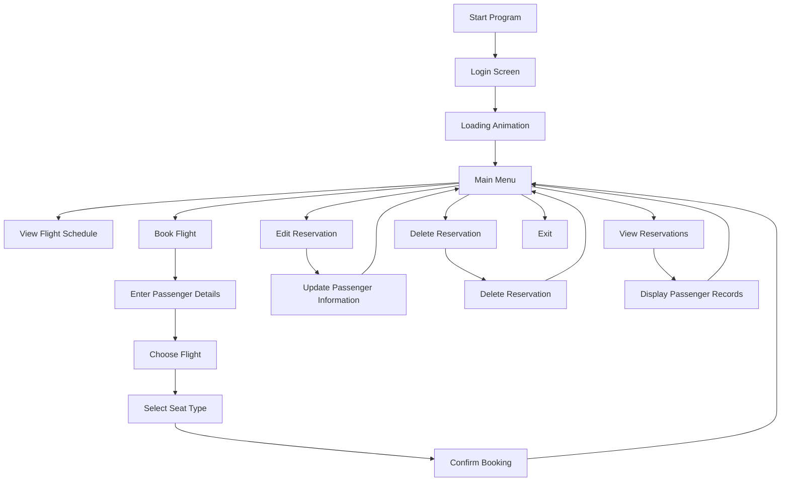

<div align="center">

# ✈️ Airline Reservation System

### A Feature-Rich Airline Reservation Management System Built with C++ and Object-Oriented Programming

A console-based application that simulates the complete airline ticket booking process, including passenger management, reservation handling, flight scheduling, and seat allocation using **Object-Oriented Programming (OOP)** principles.


</div>

---

# 📖 Overview

The **Airline Reservation System** is a console-based application developed in **C++** that simulates the workflow of a real-world airline booking platform.

The project demonstrates the practical implementation of **Object-Oriented Programming (OOP)** concepts such as **classes, inheritance, encapsulation, objects, and member functions**, while providing an interactive menu-driven experience.

Users can book flights, manage reservations, update passenger information, view available flights, and cancel bookings through an intuitive command-line interface.

---

# ✨ Features

- 🔐 Login screen with loading animation
- ✈️ Flight schedule management
- 👤 Passenger information management
- 🎫 Flight reservation and booking
- 💺 Seat selection (Window / Standard)
- 📋 Display all reservations
- ✏️ Edit reservation details
- 🗑 Cancel reservations
- 📊 Flight availability management
- ⚠️ Input validation and error handling
- 🎨 Console interface with colored output
- 🧾 Passenger record management

---


# 🏗️ System Architecture



---

# ⚙️ Workflow

```text
Start Application
        │
        ▼
Login Authentication
        │
        ▼
Loading Screen
        │
        ▼
Main Menu
        │
 ┌──────┼─────────────┐
 ▼      ▼             ▼
Flights Reservation View
 │         │           │
 ▼         ▼           ▼
Passenger Seat      Records
Details   Selection
 │
 ▼
Reservation Saved
 │
 ▼
Edit / Delete / View
 │
 ▼
Exit
```

---

# 🛠️ Technologies Used

| Category | Technology |
|----------|------------|
| Programming Language | C++ |
| Programming Paradigm | Object-Oriented Programming |
| User Interface | Console |
| Data Structure | Arrays of Objects |
| IDE | Visual Studio Code / Code::Blocks / Dev C++ |

---

# 🧠 OOP Concepts Demonstrated

✔ Classes

✔ Objects

✔ Inheritance

✔ Encapsulation

✔ Member Functions

✔ Constructors

✔ Arrays of Objects

✔ Function Overloading (if implemented)

✔ Menu Driven Programming

---

# 📌 Functional Modules

## 🔐 Login Module

- Login screen
- Loading animation
- Interactive interface

---

## ✈️ Flight Schedule

Displays:

- Flight Number
- Departure
- Destination
- Available Seats

---

## 👤 Passenger Module

Stores:

- Name
- Age
- Gender
- CNIC
- Passport Number
- Address
- Contact Number

---

## 🎫 Reservation Module

Allows passengers to:

- Book flights
- Choose departure city
- Select destination
- Reserve seats
- Confirm reservation

---

## 💺 Seat Allocation

Seat options:

- Standard Seat
- Window Seat

---

## ✏️ Reservation Management

Passengers can:

- Update personal details
- Change flights
- Modify seat selection

---

## 📋 Reservation Records

View

- Single reservation
- Complete reservation database

---

## 🗑 Cancellation Module

Delete reservations whenever required.

---

# 📂 Project Structure

```
airline_reservation_oops/

│── Airline Reservation Project(1).cpp
│── README.md
│── LICENSE
```

---

# 🚀 Getting Started

## Clone Repository

```bash
git clone https://github.com/riyav1606/airline_reservation_oops.git

cd airline_reservation_oops
```

---

## Compile

Using GCC

```bash
g++ "Airline Reservation Project(1).cpp" -o airline
```

---

## Run

### Windows

```bash
airline.exe
```

### Linux / macOS

```bash
./airline
```

---


# 📈 Future Enhancements

- 💾 File handling for persistent storage
- 🗄 Database integration (MySQL/PostgreSQL)
- 🌐 Online booking interface
- 🔑 User authentication
- 💳 Payment gateway integration
- 🎟 Ticket generation in PDF
- 📧 Email confirmation
- 👨‍💼 Admin dashboard
- 📊 Flight analytics
- 🔍 Search and filter reservations

---

# 🎯 Learning Outcomes

This project demonstrates practical experience with:

- Object-Oriented Programming
- Real-world system design
- Menu-driven application development
- Data management using classes
- CRUD operations
- User interaction through console applications
- Input validation
- Program modularization

---

# 🌟 Why This Project?

This project was built to strengthen my understanding of **Object-Oriented Programming** by implementing a real-world airline reservation workflow. It focuses on designing reusable classes, managing passenger data, and simulating booking operations while maintaining a structured and modular codebase.

---

# 👩‍💻 Author

**Riya Vairale**

GitHub: https://github.com/riyav1606

---

# 📄 License

This project is licensed under the **MIT License**.

---

<div align="center">

### ⭐ If you found this project useful, consider giving it a star!

**Built to explore how Object-Oriented Programming can be used to model and simulate real-world reservation systems.**

</div>
